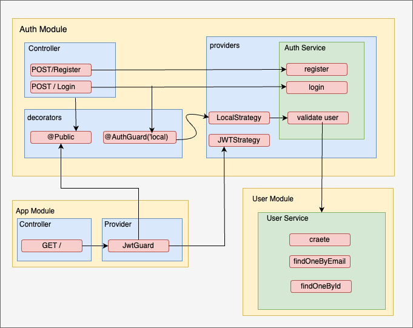

## Description

This repository contains implementation of authentication and authorization processes in a NestJS project using the Passport middleware module.



## REST API

1. Exposed RESTful APIs to make CRUD operation of Task resource
   1. As a user, I should be able to create an accont
   2. As a user, I should be able to login with my email and password and get
      an access token(JWT token) in response if successful
   3. As a user, I can create a task
   4. As a user, I can edit my existing task
   5. As a user, I can delete my existing task
2. All the endpoints are guared with user authentication
3. Stateless Authentication implemented via JWT Token
4. A user who created the todo can edit or delete that issue
5. Rest API documentation achevied using Swagger

## Project setup

```bash
$ npm install
```

## Compile and run the project

```bash
# development
$ npm run start

# watch mode
$ npm run start:dev

# production mode
$ npm run start:prod
```

## Run tests

```bash
# unit tests
$ npm run test

# e2e tests
$ npm run test:e2e

# test coverage
$ npm run test:cov
```
